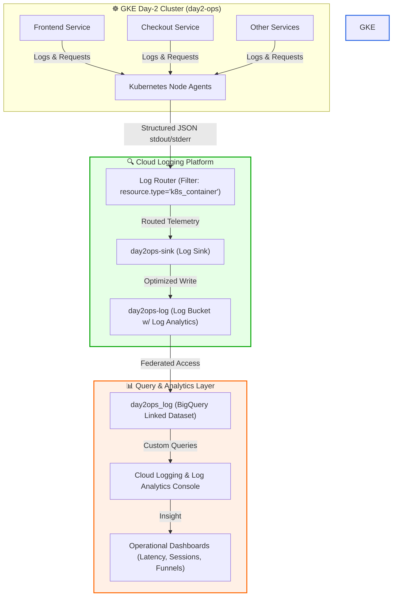

# ☸️ GKE Day-2 Ops: Cloud Logging & Log Analytics Engine

[](https://cloud.google.com/)
[](https://kubernetes.io/)
[](https://cloud.google.com/bigquery)
[](https://opensource.org/licenses/MIT)

A production-grade demonstration showcasing **Day-2 Kubernetes Operations** on Google Kubernetes Engine (GKE) using **Cloud Logging**, custom **Log Sinks**, and **Log Analytics** with linked **BigQuery Datasets** for SQL-driven application insight.

This repository serves as a proof of work illustrating telemetry pipelines, log-routing optimization, and custom monitoring queries built to analyze a distributed microservices architecture (Google's *Online Boutique*).

---

## 🏗️ Architecture Flow



---

## 🛠️ Technology & Operations Stack

- **GKE (Google Kubernetes Engine)**: Managed Kubernetes environment running v1.31.5.
- **Google Cloud Logging**: Logs Router, custom Log Sinks, and upgraded Log Analytics buckets.
- **BigQuery (Linked Datasets)**: Real-time SQL query compilation over raw logs.
- **Online Boutique**: Multi-service microservices application (Go, Python, Java, C#, NodeJS) used to generate operational traffic patterns.

---

## 📁 Repository Structure

```text
.
├── README.md                  # Comprehensive proof-of-work documentation
├── scripts/
│   └── setup.sh               # Shell script automating GKE cluster authorization & app deployment
└── queries/
    ├── latency_analysis.sql   # SQL query analyzing Min/Max/Avg frontend latencies
    ├── product_visits.sql     # SQL query calculating product detail page metrics
    └── checkout_funnel.sql    # SQL query tracking sessions completing checkout process
```

---

## 🚀 Step-by-Step Operations Walkthrough

### Task 1: Infrastructure Initialization & Cluster Verification

Use the custom script or manual commands to authenticate to the Kubernetes cluster and verify nodes:

```bash
# Verify cluster status
gcloud container clusters list

# Fetch credentials for the active cluster
gcloud container clusters get-credentials day2-ops --region europe-west4

# Ensure nodes are provisioned and Ready
kubectl get nodes
```

### Task 2: Deploying Microservices Workloads

Clone the Google Microservices Demo and apply manifests to test telemetry capturing:

```bash
# Clone the demo source repository
git clone https://github.com/GoogleCloudPlatform/microservices-demo.git
cd microservices-demo

# Apply all resources
kubectl apply -f release/kubernetes-manifests.yaml

# Poll pod deployment status until all replicas report "Running"
kubectl get pods --watch
```

Confirm service readiness by acquiring the External Load Balancer IP and querying HTTP status:

```bash
export EXTERNAL_IP=$(kubectl get service frontend-external -o jsonpath="{.status.loadBalancer.ingress[0].ip}")
curl -o /dev/null -s -w "HTTP Response Code: %{http_code}\n" http://${EXTERNAL_IP}
# Output: HTTP Response Code: 200
```

---

## 🪵 Log Routing & Storage Administration (Day-2 Tasks)

To run advanced diagnostics, we optimize storage and filter noise by upgrading log destinations.

### 1. Upgrade Default Bucket to Log Analytics
- Upgraded the existing default log bucket `_Default` to support SQL querying engine.
- Configured native Log Analytics views `_AllLogs` in the global scope.

### 2. Provision Custom Log Bucket & Sink Routing
- Created a new target Log Bucket `day2ops-log` in region `Global` with **Log Analytics** enabled.
- Created an associated **BigQuery Linked Dataset** named `day2ops_log` to run complex analytical scripts directly on raw logging formats.
- Configured a routing **Log Sink** (`day2ops-sink`) targeting container workloads:
  ```text
  resource.type="k8s_container"
  ```
  This routes only target application logs, reducing indexing costs by filtering out GKE control plane noise.

---

## 📈 SQL Analytics & Operational Dashboarding

With logging schemas synced to BigQuery, we execute analytical queries within **Log Analytics**:

### 📊 Latency Metrics (Frontend Service)
To monitor API quality of service (QoS) and alert on performance regressions, run:
👉 **[latency_analysis.sql](./queries/latency_analysis.sql)**

```sql
SELECT
  hour,
  MIN(took_ms) AS min_latency_ms,
  MAX(took_ms) AS max_latency_ms,
  AVG(took_ms) AS avg_latency_ms
FROM (
  SELECT
    FORMAT_TIMESTAMP("%H", timestamp) AS hour,
    CAST(JSON_VALUE(json_payload, '$."http.resp.took_ms"') AS INT64) AS took_ms
  FROM
    `day2ops-log._AllLogs`
  WHERE
    timestamp > TIMESTAMP_SUB(CURRENT_TIMESTAMP(), INTERVAL 24 HOUR)
    AND json_payload IS NOT NULL
    AND SEARCH(labels, "frontend")
    AND JSON_VALUE(json_payload.message) = "request complete"
)
GROUP BY 1 ORDER BY 1;
```

### 🛒 Marketing & Business Funnel Analysis
Identify traffic patterns for product page hits and track conversions (sessions completing checks):
👉 **[product_visits.sql](./queries/product_visits.sql)** & **[checkout_funnel.sql](./queries/checkout_funnel.sql)**

```sql
-- Tracking session checkouts
SELECT
  JSON_VALUE(json_payload.session) AS session_id,
  COUNT(*) AS checkout_count
FROM
  `day2ops-log._AllLogs`
WHERE
  JSON_VALUE(json_payload['http.req.method']) = "POST"
  AND JSON_VALUE(json_payload['http.req.path']) = "/cart/checkout"
  AND timestamp > TIMESTAMP_SUB(CURRENT_TIMESTAMP(), INTERVAL 1 HOUR)
GROUP BY 1;
```

---

## 🛡️ Key Takeaways for Day-2 Ops

1. **Storage Optimization**: Log buckets filtered via Sinks ensure that only queryable application logs consume analytics budgets.
2. **Real-time Analytics**: Linkage with BigQuery enables engineers to write native SQL queries on unstructured and structured logging data without spinning up manual pipelines.
3. **Decoupled Monitoring**: Metrics parsed from JSON payloads reduce the overhead of application code modifications for telemetry collection.

---
*Developed as part of Cloud Infrastructure Day-2 Operations portfolio verification.*
